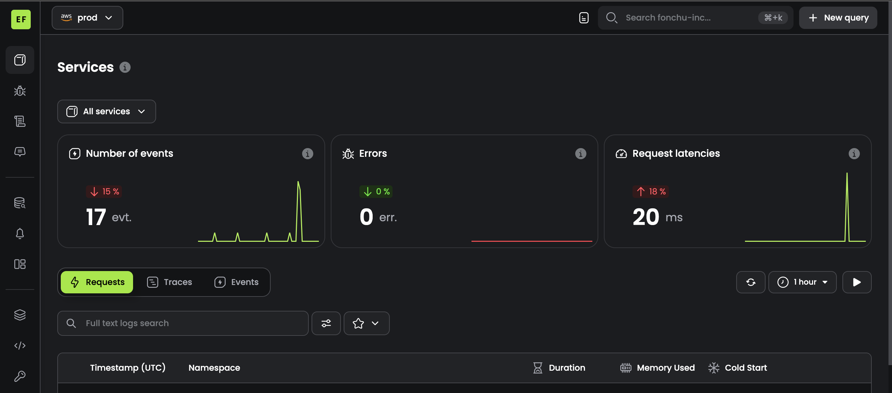

# Configure observability with baselime.

To configure observability with `baselime`, create an account on [baselime](https://baselime.io/) and link your AWS account to it so that baselime can automatically read and detect cloudwatch logs and send you notifications without you having to visit the `aws console`

## Baselime console.

