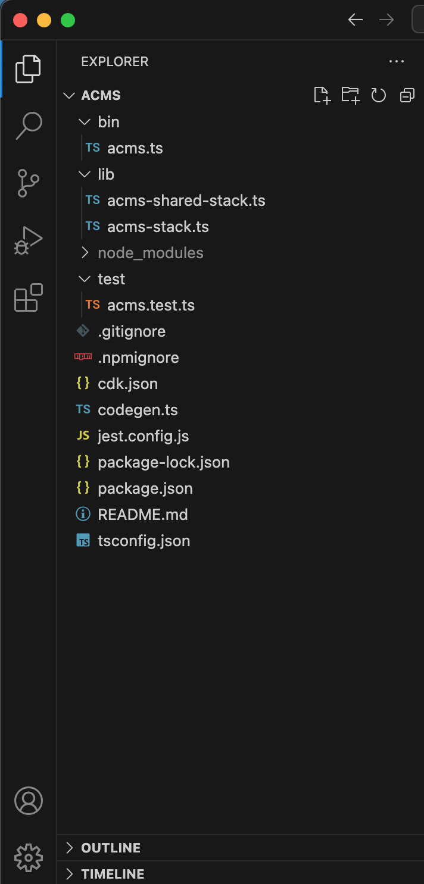

## Starter Files.

To get started, clone the branch that contains the starter files from [github](https://github.com/EducloudHQ/apartment-complex-management/tree/master).

## File Structure
The file structure should look like:

Let's breakdown the most important files used for the workshop.

- `lib/lib/acms-shared-stacks.ts` is where your CDK application’s main stack is defined. This is the file we’ll be spending most of our time in.

- `bin/acms.ts` is the entrypoint of the CDK application. It will load the stack defined in `lib/acms-stack.ts`.

- `package.json` is your npm module manifest. It includes information like the name of your app, version, dependencies and build scripts like “watch” and “build” (package-lock.json is maintained by npm)

- `cdk.json` tells the toolkit how to run your app. In our case it will be `npx ts-node bin/acms.ts`

- `tsconfig.json` your project’s typescript configuration

- `.gitignore and .npmignore` tell git and npm which files to include/exclude from source control and when publishing this module to the package manager.

- `node_modules` is maintained by npm and includes all your project’s dependencies.

- `lib/acms-shared-stacks.ts` we define common AWS resource that are used by other stacks.
