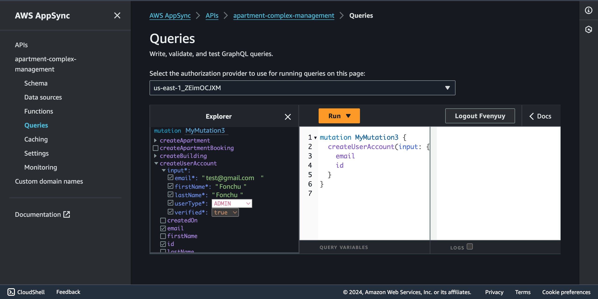

## Testing the User Endpoints.

To get started, create a new user in Cognito and use the credentials to login in appsync and execute queries.

- Let's create a new user in Cognito

- Use the created user credentials to login into appsync console so as to execute the `create user mutation`

- User created successfully

